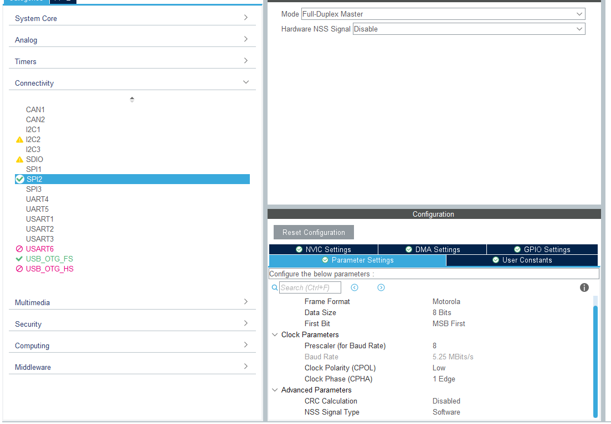
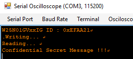

# stm32f405rgt6-w25n01-Flash-Driver | Project : ExternalFlashStorage

## Overview
**ExternalFlashStorage** is a project designed to interface with the W25N01GVZEIG IC, a NAND flash memory chip, using the STM32F405RGT6 microcontroller via SPI protocol on my custom-made PCB. This project provides efficient drivers to **read** and **write** data to the flash memory while leveraging the STM32's 168 MHz internal clock and debugging with CDC transmissions.

## Features
- **Flash Memory IC**: W25N01GVZEIG
- **Microcontroller**: STM32F405RGT6
- **Communication Protocol**: SPI (Serial Peripheral Interface)
- **SPI Configuration**: Full-Duplex Master
- **Clock Speed**: 168 MHz (Internal clock)
- **Debugging**: CDC transmissions

## Flash circuit configuration
The following schematic snippet shows the circuit configuration for the W25N01GVZEIG flash memory, including essential connections like **!CS**, **SPI_SCK**, **MISO**, **MOSI**, **!WP**, and **!HOLD** pins. 

### Key Pin Connections:
- **!CS**: Chip Select (Initiates and ends SPI commands)
- **SPI_SCK**: SPI Clock
- **MISO/MOSI**: Data transfer lines
- **!WP**: Write Protect (Configured as HIGH to enable writing)
- **!HOLD**: Keeps the flash operational without standby (Configured as HIGH)

## STM32F405 SPI Configuration
The STM32F405 is configured as a full-duplex master using the SPI protocol, with the configuration shown in the image below:

## Flash Driver
The flash driver files are located in the `Inc` and `Src` directories:
- **Header File**: `flashDriver.h`
- **Source File**: `flashDriver.c`

### Available Flash Driver Functions:
- **Read Flash ID**
- **Chip Memory Reset**
- **Block Memory Reset**
- **Read/Write Status Registers**
- **Byte Read/Write**
- **Page Read/Write**

In the `main.c` file, an example of reading and writing to a single page address is provided using the custom-made driver.

## Debugging
Debugging was achieved via **CDC transmissions**, and a serial oscilloscope was used to monitor data. The image below shows an example of CDC messages during debugging:

## Applications
This project can be used for various applications where efficient external storage and data management are required using the W25N01GVZEIG flash chip. The provided drivers allow users to interact with the flash memory in a variety of ways, such as:
- Storing and retrieving data
- Managing memory blocks and registers
- Ensuring proper operation through status checks

